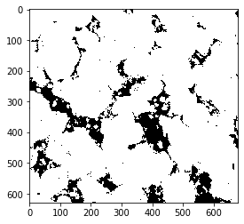

# Autorev
Auto calculate and plot the representative elementary volume (REV) of a porous medium using porosity


```python
import numpy as np
import matplotlib.pyplot as plt
from tqdm import tqdm
#from joblib import Parallel, delayed
```

### Generate synthetic data


```python
sample_array=[]
n_slice=30
image_shape=(35,35)
for i in range(n_slice):
    i= np.random.randint(2, size=image_shape)
    sample_array.append(i)
sample_array=np.asarray(sample_array)    
print ('generating a 3D volume of size',sample_array.shape)
```

    generating a synthetic 3D sample volume of size (30, 35, 35)


Generate a random coordinate for subsampling


```python
import random
def gen_pos(shape,size):
    x=random.randint(0, min(shape)-size)
    y=random.randint(0, min(shape)-size)
    z=random.randint(0, min(shape)-size)
    return x,y,z #slice, row, colomn
```


```python
gen_pos(sample_array.shape,10)
```


    (12, 3, 4)


Generate a 3D subsampling window with given coordinate and window size


```python
def window3d(x,y,z,size,sample_array):
    subsample=[]
    for i in range(size):
        for j in range(size):
            subsample.append(sample_array[i+x][j+y][z:z+size])
    return np.asarray(np.split(np.asarray(subsample),size))
```


Calculate volume of voids and total volume in the subsampled window and return porosity

```python
def porosity(a):
    void=np.count_nonzero(a==0)
    volume=a.shape[0]*a.shape[1]*a.shape[2]
    phi=void/volume
    return phi
```

Iteratively generate random subsampling windows and calculate porosity for 10 times, with fixed window size

```python

def rev_sampling(sample_array,size,n_iter=10):
    revlist=[]
    for i in range(n_iter): #number of iterations for each window size
        x,y,z=gen_pos(sample_array.shape,size)
        sample=window3d(x,y,z,size,sample_array)
        poro=porosity(sample)
        revlist.append(poro)
    return revlist
```
 Increase window size step-wisely and plot the porosity measurements

```python
def plot(size,data,tp,fsize=20):
    plt.figure(figsize=(15,9))
    for ind,i in enumerate(data):
        x=np.full(shape=10,fill_value=((ind+1)*size)**3,dtype=np.int)
        plt.plot(x,i,'.')
        plt.xlabel('Subsample volume',fontsize=fsize)
        plt.ylabel('Porosity',fontsize=fsize)
        plt.xticks(fontsize=fsize)
        plt.yticks(fontsize=fsize)
    plt.axhline(tp,0,1,label='sample total porosity')
    plt.legend(fontsize=fsize)
    return
```

```python
def rev(sample_array,step=10): #step must be smaller than the sample lenghts
    size=round(min(sample_array.shape)/step)-1
    rev_all_list=[]
    for i in tqdm(range(step)):
        rev_all_list.append(rev_sampling(sample_array,(i+1)*size))
    total_porosity=porosity(sample_array)
    plot(size,rev_all_list,tp=total_porosity)
    return rev_all_list
```

```python
rev0=rev(sample_array,step=15)
```


    100%|█████████████████████████████████████████| 15/15 [00:00<00:00, 468.75it/s]


Because synthetic data are randomly generated with 0s and 1s, therefore the porosity should be close to 0.5. From the plot we can see porosity converging to 0.5 as the subsample volume gets larger. The representative elementary for the synthetic data is 750 because from that point on, the porosity measurements converged and stabilised around 0.5.

## Input real data

Now calculate REV with real porous rock data

```python
import glob
import os
from PIL import Image
```

```python
folder='N:\\PRESALT_FLOW\\FROM CTLAB\\PRESALT FLOW\FF4402H_EXPT_1_FEB_2018\\H2O_Saturated\converted\\NLM'
list_of_imgs=sorted(glob.glob(os.path.join(folder,'*.tif')))
```

## Inspect the image data

```python
def import_img(file):
    img=Image.open(file)
    img=np.asarray(img)[196:825,170:850]
    return img
```

```python
img0=import_img(list_of_imgs[0])
```


```python
plt.imshow(img0,cmap='gray')
```


    <matplotlib.image.AxesImage at 0x4279608>


Apply a simple thresholding to segment the porosity and rock

```python
porespace=np.zeros(img0.shape)
porespace[img0>38]=1
plt.imshow(porespace,cmap='gray')
```


    <matplotlib.image.AxesImage at 0x42fd2c8>




Load the image data into a 3D np.array

```python

sample_3d=[]
#n_slice=len(list_of_imgs)

for i in tqdm(list_of_imgs):
    img= import_img(i)
    porespace=np.zeros(img.shape)
    porespace[img>38]=1
    sample_3d.append(porespace)
sample_3darray=np.asarray(sample_3d)    
print ('generating a 3D volume of size',sample_3darray.shape)
print ('total porosity:',porosity(sample_3darray))
```

    100%|███████████████████████████████████████| 887/887 [00:04<00:00, 183.83it/s]


    generating a 3D volume of size (887, 629, 680)

Now run the rev function and show the rev plot

```python
rev_f4402h=rev(sample_3darray,step=10)
```


      0%|                                                   | 0/10 [00:00<?, ?it/s]
     10%|████▎                                      | 1/10 [00:00<00:01,  6.58it/s]
     20%|████████▌                                  | 2/10 [00:00<00:02,  3.20it/s]
     30%|████████████▉                              | 3/10 [00:02<00:05,  1.33it/s]
     40%|█████████████████▏                         | 4/10 [00:06<00:09,  1.56s/it]
     50%|█████████████████████▌                     | 5/10 [00:12<00:15,  3.04s/it]
     60%|█████████████████████████▊                 | 6/10 [00:23<00:21,  5.49s/it]
     70%|██████████████████████████████             | 7/10 [00:40<00:26,  8.78s/it]
     80%|██████████████████████████████████▍        | 8/10 [01:04<00:26, 13.37s/it]
     90%|██████████████████████████████████████▋    | 9/10 [01:36<00:19, 19.00s/it]
    100%|██████████████████████████████████████████| 10/10 [02:21<00:00, 14.11s/it]


The subsample porosity measurements converged and stabilised around the sample total porosity (0.1) from around 0.5e8 voxels, therefore it is the REV of this sample.
